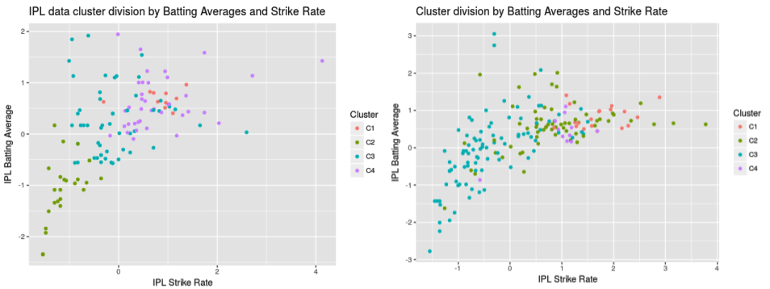

# Portfolio

<!-- ## Natural Language Processing -->
<!-- --- -->

* TOC
{:toc}

---
## NLP Projects

### 🆕 Content-Based Filtering: NLP Based Book Recommender Using BERT-Embeddings

 I created a content-based book recommendation system that, given a book name, suggests books that are similar to it. The choice is made considering concise information of the book such as its theme, author, series, and summary of the description. The succinct data of keywords that is provided to the recommender system is generated using NLP techniques such as word embeddings. Keywords that most describe the book are extracted from the book description using BERT-embeddings, this word collection is further reduced using the frequentist feature extraction method TF-IDF that ranks the words based on their frequency in the book and the corpus.

 

 

---
## Data Science Projects

### Payment Default Prediction

 Using the dataset containing a series of account statements having some pre-processed features representing a time frame, I developed a logistic regression modle to predict the probability of each customer (account holder) defaulting their next payment. The final working model is built into an AWS web application that accepts the account data and display statement Id and prediction of default for it.

 

 

---
### Click-Stream Data Anomaly Detection

 In this project I identify anomalous session activities based on the click-stream collected for sessions. All the session activities are recorded for each individual user (IP Address) on a single web page. Making use of a stochastic process called Markov model, implemented using R, I build a intuition about how a categorical temporal data such as click-stream changes over a time at discrete time stamps.

 

 

---
### Predictive Modeling For Real Estate Properties.

 Implementation and comparative analysis of various predictive models (such as Multiple Linear Regression,
Support Vector Machine, Regression Trees and Random Forest) to predict features like property rent price and cost of hosting extra people using real estate data.

 

 

---
### Performance Based Recommendation Of IPL Playing XI Team

[![Read Blog](https://img.shields.io/badge/Dataone-Read_Paper-blue?logo=data%3Aimage%2Fpng%3Bbase64%2CiVBORw0KGgoAAAANSUhEUgAAADIAAAAyCAYAAAAeP4ixAAALAUlEQVR42sWaA3Qk2ffHe8zYHts21t6xbXu9O7Yy1mq8Y9u2bXZsq9Pf%2F%2FfWqfRJanuSSTb9%2F9U5n1ODwvvUfffWq%2Fdal7Z5zEkRCpA%2BZBc5Q26TFySIRJI4kpSOeBJFgtTjbpKjZC2ZRvqRD0hpUpzotOTWphX5hoQT5BLJ6gN4Tk6QxaQXqUaK5bqUKlKY7CEwMTs5Q8Pc%2BXf3WUlwm5EIt%2BkJcJsWD9ep8XATpiUo%2F%2B4%2BM4nH8Dj1XDOkkmBykvxG6pEiuSKkipQleu2NpeEuE2Pg9GMYHEYHwm64HrZD3sB20GvYDnwFGyJ75e%2BD38Bu6FvYj%2FCDw5hAOP4QCudfI%2BE6OVbE3yUXqj7AzsQ%2BR0IakU9IgvZGLuOjYNP%2FJaz7Ps8Z%2FV7I%2BYqk%2FUh%2FOFFOHgyjpxVKUvOyCymWYxk1yY3aruQwNsjUIMGKFCfF%2Br1Esf4Kyt%2BtiS2Ps%2B%2FzDA7pkH%2BzkuPTzpFriNiQt3AcF0ypaOmO6YUSyDZSO9syqsj32mjIU7MeqlcaII2Rhnn3fIjqnW%2Fhw7aX0PnrUxj5yUFMbrETC5tsxh8NNmBd3bX4p%2FZqbCIba6%2FBH%2FU3YF7jrfjxg73o8eUJfNDuMip0uwun3k%2BVB1B8ALvlcD84%2FRwu3S%2F9%2FV%2BqhaEAyZbIZHeJggjMNcB1ngFeE6PQrOM19PniGKY234H19dbiRLXluF1hAZ6XmQN9qZkIKDkDQSWmZ0lgyenw4%2FHPeN7lSouxqc5q%2FPzBHnza5iK8ezyUB8WH9lZyMX23i2GvGC%2FFIEuZxbpdCi7zDTM8GeJyv8Wg3tAgfN72OX5qcBIPys6Hf6kZ6Ro0Q2m8f3rYwCxIf7xJXq4lD%2BRo9ZX47YPdaNjhGuz6PoP1MD2cf4uU6icyiWQKhQpxn6lIYfLBoBpXjg6tegkTnI9ibqG9WKjbhcNWf5oa7SeNyQZ%2Bco7gw0h4Ezbcv8Ic%2BJebLf%2BeQU6iJVJ3y%2FtiSaNNaN7uCmwZIbsxQUqJV1%2B8IyiTh%2Ft3itQj%2Fot1O7FEt4PsxGKV847LEcBo5Kjh8uSrzEPQR6sQPmQnYlZcRMLxpwhptVqOyXguMUWKUvfLz8eMZttRqesdpbu5TIiGOnpo6THX8E6R3iSZII1FZFmeHbjttihTkfQNl78H1PBF8Jd%2FIWLMXsSuvoqkK29gCIqBMSUVshmTDQjtstF0vDlESoSEk1WXo%2FU3Z2A34CUcf4mQKnrCY57BvsxWmBWZTYxakd%2FzbcNjTyU%2F3ikh3STkm9WI%2FPkg4jbdQtItf6SGxcGYaoS5zZiQkqWIKmPqco%2FLzsMPH%2B6Da5%2BncPgxLJmleoBOV96syE4CrcjqApvxwmdOpiIB1eYj8cIrmN9yLqKNzlvuJXdKs%2FTbjgu%2B6DYlxo5V7l8i17UiC8nGwhvxpsSszESYwDMQNeukRMAiItr8kZJdreudxCIDXw%2FlCziPbpA%2Bg4jenMjWouugLznTvIiKiAQ2WCJdyjIi2q5G9tX8HQ06Xg8oMOD1hzZ9n2cQiTEnsqv4GvhlISJIskvjUt5GWkxEmzeH%2Bd5p2e7yZd0Qf68Co0JMIqnmRPZarRaJrEXULhbSfh0Sjj6BISQ2O8mefVSZgzVWGb9sfX6%2Bbhby695CEYE5kQPWf2tFsizD8sIL7bQBhoBoy4mkyxnKhPb74ljTNz4zFRGjeZG%2FNCJZIzKBDZcg5U2ERUS03UzP%2FdVKizadqr68qIgk5JoIu1hQ02Uw%2BEVZTEQrw300hbqKSJA5kf1Wf%2BdAhAPLlitgCIy2vIhaiNSx4BURuWtOZLdatbLbtWRsZQiOsbDIDIEPbiYulVmSsrbOupMiss%2F8e2Q99DkQCf70DxhC43JXRBMF4bHHfGxxWRvTv%2BaJSQX6vnUWkTnEqBVZX%2BgfvC4xO%2FsiHDSmRsTnvogqIKONcw4rsMh6R2z3cmfG6MbF5vfs8lgnIt1Ionas9Ue%2BrXjqNS%2FbIjKITI1OzB0RTRQecRC7q%2BhaTLHan9Kq5sUZut8CC5Rt%2F9D0QqxK9FqRpRzG39IM47NCGhjSdi1SY5NybdAoAtLFLzkvw5r8mzHB6gAatHrobzUlplypzo8yDFGKk2NaEeGk%2Fapsi8gL0RifnDMRbUUiT73mYh8r6HLddoy3PoiarR%2FCeUrcOc%2BlsDL3zT7eXJ5sKbIeb7Uj4KxEemyCMTHlP4jMMEXhivNSrC24Sfla%2FcXuEKp%2Bcw9Ov0XK1%2BJ8T34pmhNpSCK0UVmRdzvuuS9Qnozfe4qE9d8mX4TZEtHmwhPmpkRBvlJF4nvnIyjf6h7sxgbKhEQCRb70mJdq9uOqKDmkFREOWv9luknWItMQPnxX5oPGzqqIthupFUnmCeSjTu4tEsM9j6Fk%2B4ewHvKG88xxoMQ1fvI6ZjYl1J0kaWVW8ZP3blpUSmY%2BPJEGRk05BqPRvIh0ubCem%2BHnOU2pcMosinrdO24LsY3fQDL5IfddmGcXepc9DY8ujzkz%2BUIm8NImwL%2Fn5LouMxF7cobAhFxUzZVXPrPVm5qXkImHqNmnYPCPwrs2iVTSHX9E%2B55ByJd%2Fwr%2FMLM4LzMNBm7%2BwMu82yUtFZG6BPWhV6yKcej6ViTuZM5bJdBF5wGj4ZDW%2FJbQhsdqoiNB%2B678l9KqM5iux0VIkHHkCoyEV77tFXQ7AmWqb8Vd%2BpRsJisQkltemLa%2FDVplvfq7M8rtOUbpUMiWGve%2BMYyGykg03kgxRkb18bD33nqOWZNM8FqLmnHpvgVh9PG4veoZNtU5icb7dpmtzz3w4jgqt7itRUGbxidqlhP3EViOSqYwXL3pOFckgI2wotBHXXJYo0RGhgDIzEb%2F%2FITLbUlnFwu9F4drUh9hY9TgW52UOyPXJEjKz8F58W%2FsiXLo%2FYT6IBGFEZI1F7VIvGI3aWUtoZHo2vtlhgvOxZLmJIqGpZFIWJW%2FOcszz0Gchog8%2B%2FXfjk1MR%2FToOz7bqcbTHNfztcZDn7lQEFqkCCyg03Os4qn11FzZpaymyJ3bD9Gmz8%2BGU6CgS2RZxWIyqdYcFh%2FzofQoaGaJWFfXPK%2FNtx9bax3Gszw1c%2BOk%2BLo1%2FiLOj72J%2Fq0tYW%2BYolhbYzWN3YFG6CMj5P9sfwgdNrsK5x1OJgiqhREJWxNLyIoYSw7nPm6NFHy4tOHJp4U6ln6LQv841%2BLKKyLywSUgTIT5lskOLND6DgJRUEfi8%2FmV4dlbKaoYomCQmxUJdRB3FUps%2F58twPJnsdJubAu%2Fpifig2xuMK3MW81UhNUqZskRQ5Wdxdn8Yu1DLptfkvaAKZIyCIOuTaiT8SW9GIx%2F3%2F3mpehpl1IWfFJScEo%2Bmff3A%2FMHPXicxs%2FgB%2BObfY6o6adFawEo0p8g%2BMMcwtPIFfNHkOipyeOHAd0LxdImcHllMdfw%2BJG2B5xr5iBK5ssIrdCEGApPQPIOyLzU5HtXHhqNxf3983PkVvmj3XOHTji%2FRrLcetUaGotz4WMjCkQsT1pElVF5qsiAqq8A2A5RVYImAsvIrUWDDY3mvVdyXzO119zokIuO6e4qImKIkYq4a3IS56nEZlrmTpQrJeEkaLn9OK61GcoV0kFWpXJVQRVzIAwIL8oj8wIi7WfInHQXIbgs03kDukV9Iacv9LkWT8LkoEEmOkAHE0%2BICGpGOJIUgh0Sr%2FX86aUKKWV7AvEx1EprNXwO9JYfJeNJC%2B%2FsS4f99Uxtxg8AMSarkfTWXppDWpCwpkv3GW1YkH9lEYskbcplsUbtKT9KQeJCCRPe%2FbPz%2FAcfCT6jW42xvAAAAAElFTkSuQmCC)](https://www.dataone.io/research.html)

 Determine and model the performance metrics that influence selection of a player and suggest a set of players for aiding the team selection process. We used unsupervised machine learning technique k-Means clustering to categories players and then rank them in their assigned category to evaluate their chance of selection.

 

 

---
### Risk Factor Prediction For Cardiac Disease

 Using Fuzzy C-Means clustering algorithm on lipid profile data of patients to predict their likelihood of getting cardiac disease. Statistical analysis was carried out using R.

 

 

---
## Publication

### Updating Singular Value Decomposition for Rank One Matrix Perturbation

 Implemented algorithm for updating Singular Value Decomposition (SVD) for rank-1 perturbed matrix using Fast Multipole Method (FMM) in  time, where  is the precision of computation.

 

 

© 2022 Amoli Rajgor. Powered by Jekyll and the Minimal Theme.

