This repository contains implementation of various predictive models that are used to predict features like property rent price and cost of hosting extra people using real estate data. Aim is to understand key attributes that influence pricing of the rental properties.

# Project Details
| | |
| --- | --- |
| Title:| Predictive modeling for real estate properties. |
| Type: | Proof of Concept|
| Date: | 25th September 2016
| Span: | One week |
| Language: | R |
| | |

# Quicklinks
- 1. [Introduction](#1-introduction)
- 2. [Data Cleaning](#2-data-cleaning)
- 3. [Exploratory Data Analysis](#3-exploratory-data-analysis)
  - 3.1. [Relationship Between Continuous Variables](#31-relationship-between-continuous-variables)
  - 3.2. [Relationship Between Nominal and Continuous Variable](#32-relationship-between-nominal-and-continuous-variable)
  - 3.3. [Correlation](#33-correlation)
  - 3.4. [Categorical Variable Independence](#34-categorical-variable-independence)
- 4. [Data Transformation](#4-data-transformation)
- 5. [Modeling](#5-modeling)
  - 5.1. [Feature selection](#51-feature-selection)
  - 5.2. [Multiple Linear Regression (MLR)](#52-multiple-linear-regression-mlr)
  - 5.3. [Support Vector Machine (SVM)](#53-support-vector-machine-svm)
  - 5.4. [Regression Trees](#54-regression-trees)
  - 5.5. [Random Forest](#55-random-forest)
- 6. [Goodness of Fit](#6-goodness-of-fit)
  - 6.1. [Mean Squared Error](#61-mean-squared-error)
  - 6.2. [Regression Diagnostics](#62-regression-diagnostics)
- 7. [Improvements](#7-improvements)  
- 8. [Tools and Packages](#8-tools-and-packages)

# 1. Introduction
Predictive modeling is the process of developing a mathematical model that encapsulates the relationship between the features (variables) in the data and a feature we want to predict. Here the dataset used for predictive modeling consists of 30,000 records of rental properties having 54 features. 

| 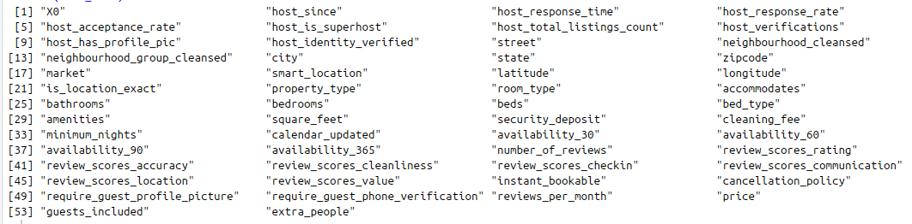 | 
|:--:| 
| **Figure 1: 54 Features List** |

Foremost, the data is processed under which it is cleaned (Section [2](#2-data-cleaning)) and formatted (Section [4](#4-data-transformation)) so that it is suitable for developing the model. (Section [3](#3-exploratory-data-analysis)) is about visualizing structure of the data and perform some exploratory analysis it in order to understand relationship among features. Section [5.2](#52-multiple-linear-regression-mlr), [5.3](#53-support-vector-machine-svm), [5.4](#54-regression-trees) and [5.5](#55-random-forest) explains various models. Section [6](#6-goodness-of-fit) and Section [7](#7-improvements) explains about the goodness of fit and improvements.

## 1.1 Developing Basic Intuition About the Data
Having quick inspection of the features present in the data in Figure [(1)](#featureList) helps in understanding the information we have about the rental properties and how it might have an effect on the price. It is important to evaluate the price of the property correctly as it directly impacts its future number of bookings, popularity and also the potential income it generates. Based on observation, following features might play a key role in deciding the price of the property.
1. **Location** : Properties that are located in the central part of the city, near to public transport and have accessibility to certain amenities such cafes, parks, tourist spots etc. might be priced higher.
2. **Property_type** : Prices for _Apartment_ will surely vary from price of a _Villa_.
3. **Room_type**: Renting _Entire Home/Apt_ is expected to be costlier than _Shared room_.
4. **Accommodates**: Number of people the property can accommodate affects the pricing.
5. **Bathrooms**: Number of bathrooms and also whether its a _full-bath_,  or _WC_ would change the price of the property. 
6. **Bedrooms**, **Beds**, and **Bed_type**: In addition to the number of people the property accommodates, the number of _bedrooms_ included in rental, also if there's possibility of having private _bed_, type of bed (_Real Bed_ or _Couch_) is governing factor in booking rate of the property, thereby affecting its price.
7. **Cleaning_fee**: Extra cleaning fee charged on top of the rent.
8. **Minimum_nights**: Minimum days of night stay that are bookable by a guest. 
9. **Booking Related Factors**: How hassel free is the booking process and whether the rental is **Instant_bookable** for last minute trip bookings and if it has guest friendly **cancellation_policy** also affects the pricing. 
10. **Amenities**: More the number of amenities, highly likely it is that the price of the rental will be more. Also property with amenities that have more weightage or popularity such as (_internet_, _parking_ facility, _pets_allowed_,  _pool_, and _24-Hour Check-in_ etc.) affects the pricing.

# 2. Data Cleaning
As part of cleaning the dataset, following steps were taken:
1. Removal of special characters such as "$", "{ }", "\" and ",". These characters were removed from variables like **Price**, **Extra_people**, **Amenities** and **Cleaning_fee**.
2. Replacing `NA` with "0" wherever the substitution is valid.\
`NA` values in **Cleaning_fee** variable is replaced with 0, assuming that there is no extra cleaning fee charged over the final price of the rental property. The substitution seems valid and also improves the model (see Section [6](#6-goodness-of-fit))
3. Certain records were removed such as records having zero values for **Bedrooms**, **Beds**, **Bathrooms** and **Price**.   
4. Also the **Bathroom** variable had decimal values which is converted to integer to reduce the complexity of the model. Decimal value such as `0.5` for bathroom indicates that the bathroom has no shower facility (_WC_). Due to this, properties having one _full-bath_ will be weighted equally to the properties with one _full-bath_ and one _WC_, in the model. Moreover, moving forward only properties that either has at least one _full-bath_ arrangement (i.e. 86.3% properties see Figure (<a href="#bathroom_freq">16</a>)) is considered. Restricting this information might affect the pricing model (see Section [7](#7-improvements))
5. In order to analyze the effect of **Amenities** variable on the **Price** of rental properties, it is cleaned, split and new variables were generated as follows.\
Originally the the **Amenities** variable is in form of a list as shown in the figure below: 

<!-- 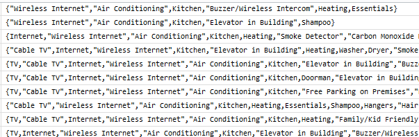 -->
<!-- <a href="#amenities">Figure 1</a>
 -->

|  | 
|:--:| 
| **Figure 2: Amenities** |

It is split and a list of unique amenities is created Figure (<a href="#amenitieslist">3</a>). However the list is not refined yet. It contains `NA` values and missing values (highlighted). Thus, all these records are merged into `NA` type.

| 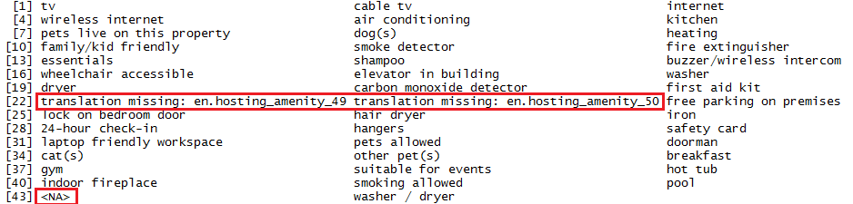 | 
|:--:| 
| **Figure 3: Amenities List** |

 Moreover, amenities such as {"TV", "cable TV"}, {"Internet", "wireless internet"}, {"cats","dogs","other_pets","pets_allowed"} and  {"washer","dryer", "washer_dryer"} are merged as they almost imply the same facility. Later the list is reduced to 35 amenities including `NA` values. Figure (<a href="#cleaned_amenity">4</a>)

| 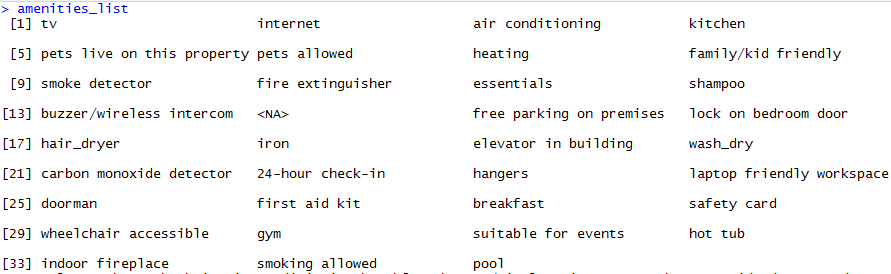 | 
|:--:| 
| **Figure 4: Final list of Amenities** |

Using the cleaned amenities five new logical variables are created **TV**, **Wash_dry**, **Parking**, **AC** and **Pool**. For which the value is set `TRUE` when the amenity is present in the sample, else it is set to `FALSE`. Empirically the five prominent types of amenities are selected for now. Pricing model can be improved by including effect of all the amenities (see Section [7](#7-improvements)).

5. Subset of features is selected from the dataset empirically (based on intuition discussed in Section [1](#1-introduction)) in order to develop the predictive model. Feature selection is done later from these features. Subset includes features such as: **latitude**, **longitude**, **Property_type**, **Room_type**, **Accommodates**, **Bathrooms**, **Bedrooms**, **Beds**, **Bed_type**, **Cleaning_fee**, **Minimum_nights**, **Instant_bookable**, **cancellation_policy** and new features **TV**, **Wash_dry**, **Parking**, **AC** and **Pool**.

6. Remove the records that contains `NA` values.\
Post cleaning, the data of 30,000 records is reduced to 26,986 records.

# 3. Exploratory Data Analysis
In order to understand the relationship among variables, Bi-variate analysis is carried out with the help of scatter plots and box plots. Moreover, the test of independence is done for continuous variables (_Correlation Matrix_) and categorical variables (_Chi-squared Test_).
	 
## 3.1 Relationship Between Continuous Variables
Figure (<a href="#sp_loc_price_extra">5</a>) shows the variation in **Price** and **Extra_people** based on location. In order to generate this visualization first the **Price** is divided into quantiles based on probabilities. 

Figure 5a: Variation in *Price* | Figure 5b: Variation in *Extra_people* Price
:-------------------------:|:-------------------------:
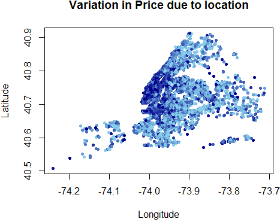  |  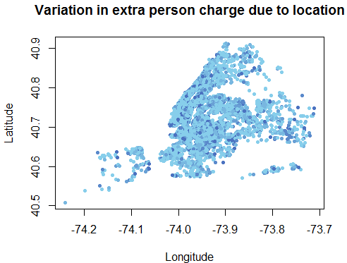

<b>Figure 5: Variation in Price and Extra_people based on location</b>

Then each record of **Price** is assigned a quantile of its range and a color code. The dark coded points represent expensive rental property. It is observed from Figure (<a href="#sp_loc_price_extra">5a</a>) that most of the properties at longitude that are greater than -74.0 are economical. Figure (<a href="#sp_loc_price_extra">5b</a>) shows that there's no impact of location on **Extra_people** price.

| 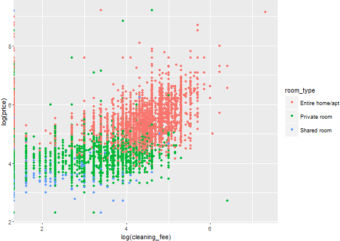 | 
|:--:| 
| **Figure 6: Price VS Cleaning_fee** |

Scatter plot of **Price** and **Cleaning_fee** Figure (<a href="#sp_clean_price">6</a>) shows that there's some correlation between them. Though, the relation is not perfectly linear and some outliers can be seen. The continuous variable **Cleaning_fee** is behaving as discrete due to repeated records. Figure (<a href="#sp_clean_price">6</a>) shows that there are only few records with **Room_type** level _"shared_room"_ and they have low values for **Price** and **Cleaning_fee**. Figure (<a href="#sp_extra_clean">7</a>) scatter plot is not good from liner modeling perspective. There are huge number of outliers, most of the records have **Accommodates** less than 4.

| 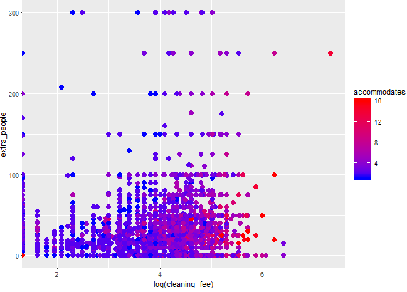 | 
|:--:| 
| **Figure 7: Extra_people VS Cleaning_fee** |

## 3.2 Relationship Between Nominal and Continuous Variables
Box plot is used to study the distribution of the data. Figure (<a href="#boxplots_price">8</a>) has boxplots for **Price**,  **Extra_people** and **Guests_included**. Figure (<a href="#boxplots_price">8a</a>), (<a href="#boxplots_price">8b</a>) and (<a href="#boxplots_price">8c</a>) shows that the distribution is more or less symmetric except in Figure (<a href="#boxplots_price">8c</a>) where for higher values, some skewness is observed. Also there is the presence of outliers. 

|||
:-------------------------:|:-------------------------:
Figure 8a: Price VS Room_type | Figure 8b: Price VS Bathrooms
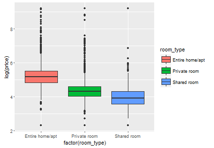  |  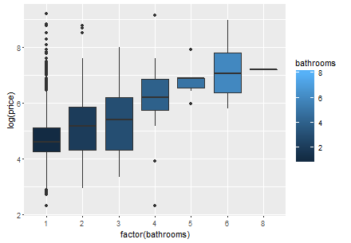
Figure 8c: Price VS Beds | Figure 8d: Guests_included VS Accommodates
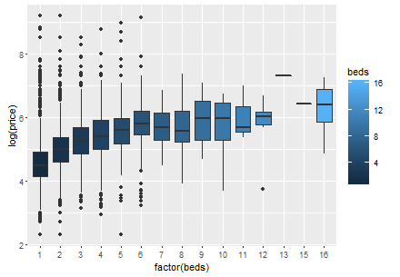  |  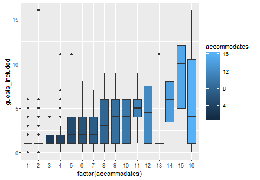
Figure 8e: Extra_people VS Accommodates
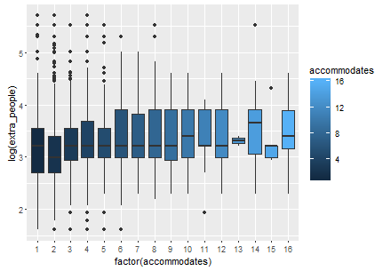

Figure 8: Box plots for Price, Guests_included and Extra_people

## 3.3 Correlation
Correlation matrix is used to testify whether the variables have some correlation (positive/negative) among them or not thereby verifying if linear model can be a reasonable fit for prediction. In order to avoid _multicollinearity_, the predictor variables must be the concise set of variables that best represents the variance in the data; algebraically quoting: "None of the predictor variables could be represented as a linear combination of the other predictor variables". Hence, the variables which have high correlation (> 0.7) among them are removed. 

| 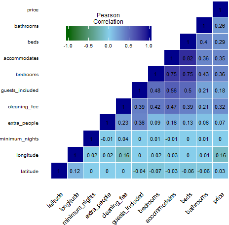 | 
|:--:| 
| **Figure 9: Correlation matrix** |

It is clear from the figure that feature **Accommodates** is highly correlated with **Beds** and **Bedrooms**, hence all of them together can not be used as predictors. **Accommodates** comparatively has good correlation with dependent variables **Price**, **Extra_people** and **Guests_included**. So only **Accommodates** is considered for further development of the model. **Minimum_nights** has nearly no relation with any of the dependent variables, thus it is removed. As correlation doesn't always imply causation, results from another feature selection method (Boruta algorithm) will also be accounted for to decide the final list of features.

## 3.4 Categorical Variable Independence
Independence of categorical variables **Room_type**, **Property_type** and **Bed_type** is measured using _Chi-squared_ test with confidence 95% ($`p`$ = 0.05). _Null hypothesis_ ($`H_0`$ = variables are independent of each other) is found to be _FALSE_ for all the variable pairs. That is all the three variables are dependent on each other and vary w.r.t the other. Thus only one feature **Room_type** is used for developing the model. 

# 4. Data Transformation
Data preprocessing steps implemented are as follows:
1. Factor variable **Instant_bookable** with only two levels is converted to a logical variable.
	
2. **Combining Levels Based on Frequency Rate**: The dataset contains factor/categorical variables having a large number of levels. When the sample data is not large enough to represent the population, having such complex feature space often reduces performance of the model as there are levels which rarely occur. Thus in order to better represent the data, levels which occurs less than 5% (of the total records) are merged.\
Only two levels of **Property_type** are retained i.e. _"House"_ and _"Apartment"_, others are merged into level _"Other"_. Similar measures are carried out for **cancellation_policy** {_"strict", "flexible","moderate"_} and **Bed_type** {_"real bed"_}.

3. It is good to standardize the continuous[^1] variables, so variables **latitude**, **longitude** and **Cleaning_fee** are mean subtracted and then scaled by inverse of standard deviation. Because of which the intercept of the linear model will represent the value of dependent variable at mean of these variables.

[^1]: Variables should be mean centered only when the mean of the variable is a valid substitution and retains the meaning of the model.

## 4.1 One - hot Encoding
In order to process nominal variables, they need to be dummy coded, i.e. such variable are represented in numerical form. One such method for transforming categorical variables in _One-Hot Encoding_. In which the levels of nominal variables are represented in terms of `0`s and `1`s, keeping one of the levels as reference (represented as all zeros).

- All the logical variables such as  **TV, AC, Parking,Pool** and **Wash_dry** are represented by `1` (`TRUE`) or `0` (`FALSE`).
- **Room_type** has reference level _"Entire home/apt"_. So the dummy coding for other levels would be as below.

<table>
<th>Level No.</th> <th>Level</th> <th colspan=2>Dummy Coding</th>
  <tr><td>1.</td><td><b>Entire home/apt</td><td>0</td><td>0</td></tr>
  <tr><td>2.</td><td><b>Private room</td><td>1</td><td>0</td></tr>
  <tr><td>3.</td><td><b>Shared room</td><td>0</td><td>1</td></tr>
</table>

After data cleaning and data transformation the final dataset has following features and format:

| 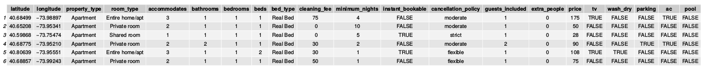 | 
|:--:| 
| **Figure 10: Cleaned and Transformed Dataset** |

# 5. Modeling

In order to make predictions, a model is generated using four machine learning techniques. First the linear model is fit to the data using _Multiple Linear Regression_. Then _Support Vector Machine_ is used to improve the linear model. Poor linear fit suggested that the relationship among features is not linear. Thus _Regression tree_ is used which makes no assumption about the underlying relationship of the data (linear or nonlinear) and is suitable for data having multiple continuous and factor variables. As the number of variables for **Guests_included** and **Extra_people** is less than required for regression trees, the tree models do no good. For improving regression tree model of **Price**, instead of a single regression tree, _Random Forest_ is used which is an ensemble technique that uses multiple same types of model in order to make predictions. In Random Forest implementation results from 1000 trees are combined.

## 5.1 Feature Selection
From the subset of variables chosen (STEP 5 Section [2](#2-data-cleaning)), variables such as **Property_type, Beds, Bedrooms, Bed_type, Minimum_nights** were removed after bi-variate analysis. In order to further reduce dimension of the problem and avoid _multicollinearity_, feature selection algorithm _"Boruta"_ based on random forest is used for response variable **Price**. For **Guests_included**, only feature that seems to have some relationship is **Accommodates**. Data is divided such that 70% is used to train the model and 30% is the test dataset which will be used to evaluate the model performance.

Final list of features selected after insights from correlation matrix, chi-squared and Boruta algorithm is **Longitude, Latitude, Room_type, Accommodates, Cleaning_fee, TV, Wash_Dry,** and **Bathrooms**.

| Sr. No. | Response Variable | Predictors| 
|:---:|:---|:---|
|1. | **Price** |**Longitude, Latitude, Room_type, Accommodates, Cleaning_fee, TV, Wash_Dry,** and **Bathrooms**|
|2. | **Guests_included**| **Accommodates** |
|3. |**Extra_people** |**Accommodates**, and **Cleaning_fee** |

## 5.2 Multiple Linear Regression (MLR)
Multiple linear Regression model for prediction of **Price** response variable had some predictors (**AC, Pool, Parking and Cancellation_policy**) which were not statistically significant i.e. their _p-values_ were less than 0.05, thus these variables are removed. Other attributes such as **Cancellation_policy, Instant_bookable** were removed as they were not improving the linear model and results of Boruta algorithm classified them as unimportant. 

## 5.3 Support Vector Machine (SVM)
SVM is widely used for classification, and can be used for the regression problem (Support Vector Regression). It improves the linear model by finding a global optimum solution. SVM models effectively capture the non-linear nature of the data, it can further be tuned to improve the results.

## 5.4 Regression Trees
Regression Trees is a non-parametric regression method and thus do not make any assumption about the underlying distribution of the data. As there are categorical predictors, trees are easy to interpret. It helps in identifying the most significant features out of all the predictors. It is not influenced by outliers, as the predictor set used here contains outliers, Regression Tree seems to be a good choice. As trees are prone to overfitting, it is important to prune the tree. As **Guests_included** and **Extra_people** doesn't have a good amount of predictors, their tree models won't use the full potential of this algorithm. 

## 5.5 Random Forest
As the dataset is not suitable for linear modeling, the choice of regression tree seems to be valid. In order to improve the tree model, instead of relying on single regression, random forest creates multiple trees and then aggregates the results from all the trees. 

# 6. Goodness of Fit
## 6.1 Mean Squared Error
Measure which is used to evaluate the performance of the model is Mean Squared Error. The measure explains how close the predictions are to the actual values. Test data set that is 30% of the entire data is used to validate the model. Figure (<a href="#error_wo_impute">11</a>) shows the MSE for all the models, when the `NA` values in the **Cleaning_fee** predictor are not replaced with zeros. In contrast, Figure (<a href="#error_w_impute">12</a>) shows MSE when the `NA` values are replaced with zeros considering that no extra fee is charged over the final amount. Results show that the imputation is valid, as reduction in MSE is observed. 

| 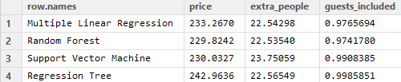 | 
|:--:| 
| **Figure 11: MSE without imputation of Cleaning_fee** |

| 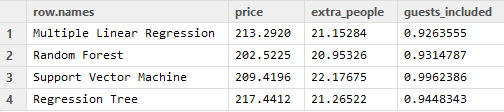 | 
|:--:| 
| **Figure 12: MSE with imputation of Cleaning_fee** |

Figure (<a href="#mse_all">13</a>) shows MSE for various models. For **price** and **Extra_people** Random Forest model has the lowest MSE, thus it will be used to make prediction using the new data. As **Guests_included** contains only one predictor, tree model is not a suitable choice. Thus MLR is used to make predictions for **Guests_included** 

Figure 13a: Price | Figure 13b: Extra_people
:-------------------------:|:-------------------------:
[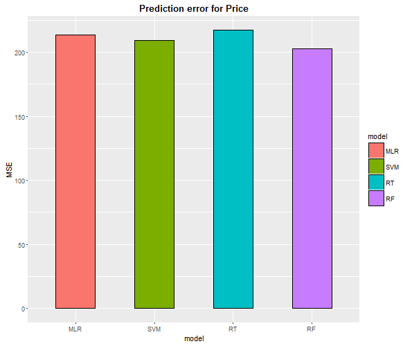](plots/mse_price.png)  | [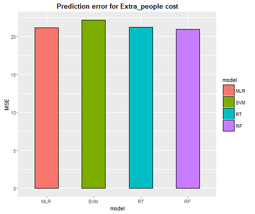](plots/mse_extra.png)
**Figure 13c: Guests_included** |
[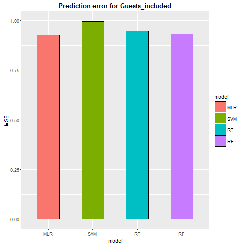](plots/mse_guest.png)

<b>Figure 13: MEAN SQUARED ERROR</b>

## 6.2 Regression Diagnostics
Once we fit the model to the data we verify if the assumptions we made for the regression model hold true or not. Essentially we check for three conditions for the residuals:
1. **Normality of the Residuals**: Errors should be normally distributed.
2. **Homoscedasticity of the Residuals**: Errors have constant equal variance.  
3. **Independence of the Residuals**: Errors are independent of one another

Figure 14a: Regression Diagnostics | Figure 14b: Residual Normality
:-------------------------:|:-------------------------:
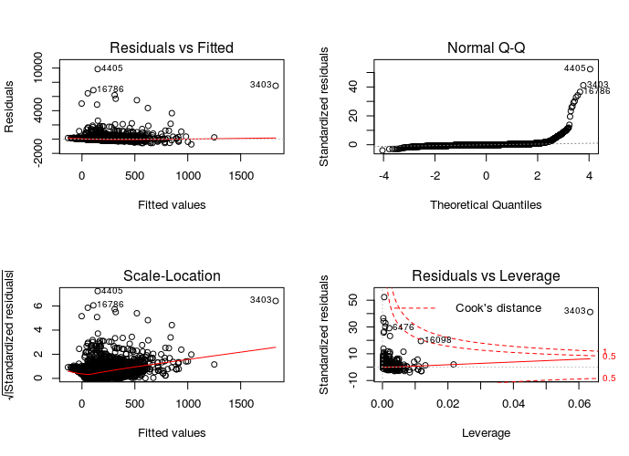  |  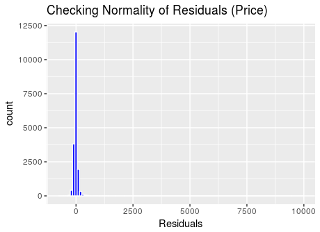

<b>Figure 14: Residual Diagnostics for Rental Price Prediction</b>

- In _Residuals Vs Fitted_ Plot (Figure ([14a](#residual_diag))) it can be seen that:
  - Residuals are scattered randomly around the residual = 0 line. Infact it is very near to it suggesting that the model is predicting the values almost correctly. Moreover, the scatterplot smoother red line is almost horizontal at residual = 0, so the decision to apply multiple linear regression fit to the data is reasonable.  
  - There are some outlier residuals that stand out from the random pattern of residuals around residual = 0 line. 

- In _Normal Q-Q plot_ (Figure ([14a](#residual_diag))) though most of the residuals follow a straight dashed line, heavy upper tail could be observed. It means the residuals have higher value than the expected, causing the residual distribution to be rightly skewed (Figure([14b](#residual_diag))). The skewed pattern is expected due to the presence of lots of outliers as seen in the _Residuals Vs Fitted_ Plot.

- In _Scale Location Plot_ in (Figure ([14a](#residual_diag)), it is observed that the red line is not horizontal and the spread around the line increases with increase in the fitted values. Thus the assumption of _homoscedasticity_ that the  residuals have equal constant variance does not hold true here. 

# 7. Improvements
- **Use Ensemble Modeling**\
It is a technique in which the models which are not highly correlated are used to make predictions. Then the weights are assigned to these different models, and predictions from all the models are aggregated. This makes prediction better and captures goodness of all the models.

- **Handling Predictor Imbalance**
  1. **Binning: Partitioning the Data**\
    The dataset used has a huge number of mixed data types additionally the nominal variables have many levels. Thus it is not efficient to perform the algorithm over the entire data; instead, the records should be grouped based on similar property values and then the separate model should be developed for each bin of the data. This brings the uniformity in the data.\
    For example, the feature **Property_type** has 18 levels , but it is found that majority of records have **property_type** either _"Apartment"_ or _"House"_, rest levels takes up less than 5% of the data (Figure (<a href="#occur">15a</a>)). Thus it will not be efficient to use the data to make predictions about properties other than Apartment or House. Similar is the case with **Bed_type** with _"Real Bed"_ level having 95% occurrence.

    

    

    | Figure 15a: Levels of Property_type | 
    :-------------------------:|
    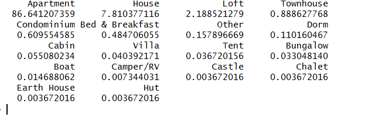  |
    **Figure 15b: Levels of Bed_type** |
    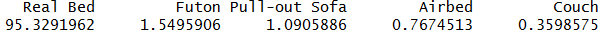|
    
<b>Figure 15: Percentage occurrence of levels</b>

    

  2. **Rebalance the Data**    
    One way to handle the class imbalance in the nominal feature **property_type** is to oversample the less occurring instances (minority class) out of all the classes and undersample the frequent ones (majority class). This makes sures that there's equal representation of each class in the training process.

    3. **Weighted Least Squares**
    In Figure ([14a](#residual_diag)) we see that the residuals do not have equal variance i.e. the data shows signs of _Heteroscedasticity_. To address this issue we can use _Weighted Least Squares_ fit for the predictors with varying variance.

- **Missing Data Imputation**\
Imputing missing data surely improves model performance. Partitioning data based on similarities and then imputing missing values by mean or median can be useful. Logistic regression can be used to predict categorical missing data.

- **Impact of Number of Bathrooms on Rental Price**\
As discussed in section [2](#2-data-cleaning) during data cleaning we have omitted properties that do not have a bathroom and considered properties having at least one _full-bath_ facility. Also, properties having additional _WC_ are treated equally as properties with no additional _WC_. These assumptions can likely affect the performance of the price model in general. For the current context, the assumption seems valid (see figure below) because there are only 108 properties without bathrooms which accounts for 0.4% of the entire data. 

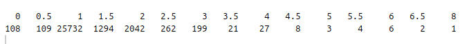  
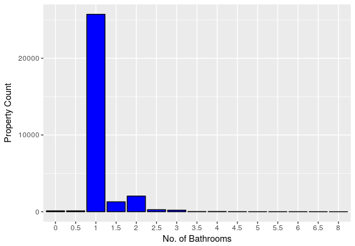

<b>Figure 16: Property Distribution based on number of Bathrooms</b>

- **Impact of amenities on Rental Price**
  - As discussed in Section [2](#2-data-cleaning), out of 42 total **amenities**, only 5 prominent ones are selected empirically. This restriction does not make full use of the potential information about **amenities**. Instead of omitting the information, new variable named **amenity_count** could be created that shows the total number of amenities the property provides. It is highly likely that the properties with more amenities are priced higher.
  
# 8. Tools and Packages
All the algorithms are implemented using R (version 3.1.1 ) language. R packages used to implement machine learning algorithms used are *rpart* (Regression tree), *e1071* (SVM), *randomForest* (Random Forest). For feature selection *Boruta* package is used. All the visualization is done using package *ggplot2*. 
For bi-variate analysis package *MASS* (Chi-squared test) and *reshape2* (Correlation matrix) are used.
